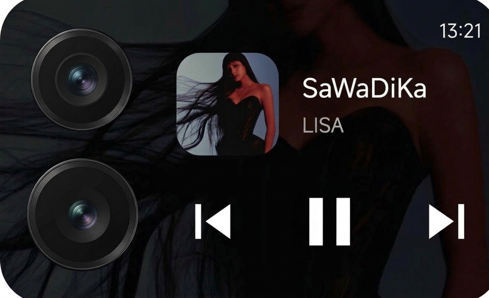

# MiRearScreenSwitcher English (feature fork)

Interactive media playback on the rear display, built on top of the English
MiRear Screen Switcher project for dual-screen Xiaomi devices (e.g.
Xiaomi 17 Pro / 17 Pro Max).

## Read all details

This repository is a feature fork. For the full original project details —
setup, Shizuku wireless debugging, quick settings tiles, rear screenshot /
recording / charging animation / notification mirroring, display tuning,
URI control, permissions, and changelog — please read all detail in:

**https://github.com/aaronnat23/MiRearScreenSwitcherEnglish**

## New features in this fork

### 1. Power off to wake rear screen

Feature branch: **`power-off-to-wake-rear-screen`**

Pressing the power button wakes the rear screen directly with MRSS, making it
fast to flip the phone and see the rear display.

### 2. Notification rear-screen wake-up

Feature branch: **`feature/notification-rear-brightness`**

When a selected app notification arrives, the rear screen wakes and shows the
notification right away.

### 3. Add media player

Feature branch: **`feat/add-media-player`**

- Shows song title, artist, and album art on the rear screen while music plays.
- Works with **YouTube Music**, Spotify, and other music apps.
- Prev / play-pause / next controls right on the rear screen.
- Notifications won't be pushed as popups while media is showing, so playback
  stays uninterrupted — but a real notification can still interrupt briefly,
  and media resumes after it.

## Requirements / Setup

You still need a Xiaomi dual-screen phone and a running Shizuku service.
Follow the Quick Setup steps in the upstream README linked above, then enable
media playback in the app and play music.

## License

GPL-3.0 (per upstream). Original author: **AntiOblivionis**
(GitHub [GoldenglowSusie](https://github.com/GoldenglowSusie/)).
